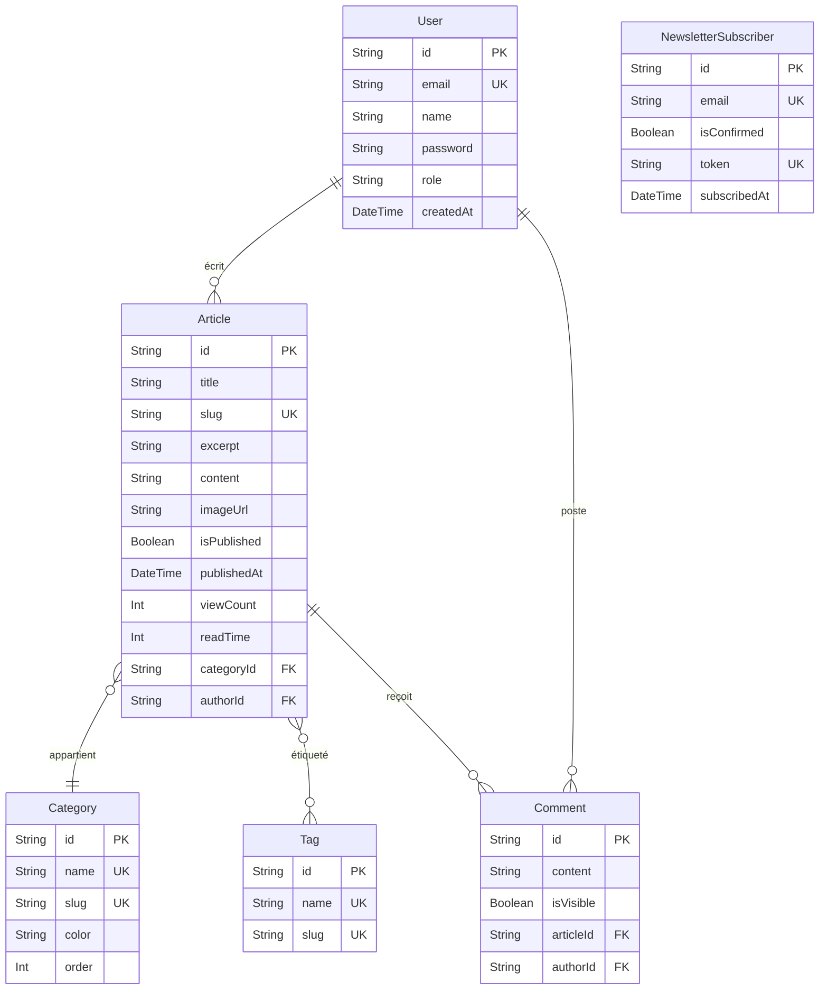
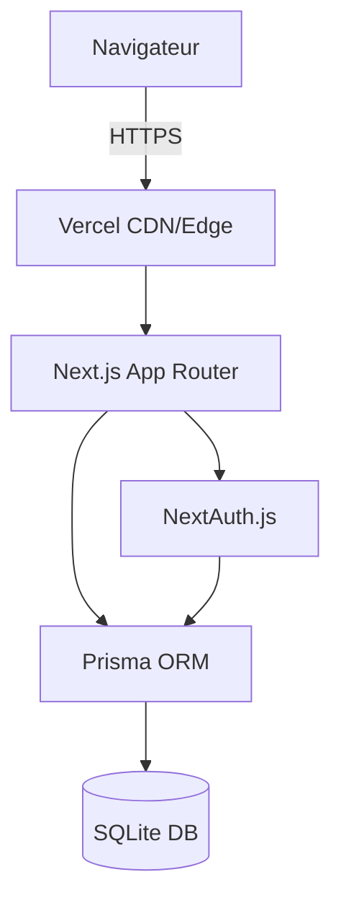

# Architecture — lemonde7

Clone de lemonde.fr — site d'information grand public

## Stack technique

| Composant | Choix | Justification |
|-----------|-------|---------------|
| Framework | Next.js 14 (App Router) | SSR natif pour SEO, routing file-based, API Routes intégrées, déploiement Vercel optimal |
| Base de données | SQLite via Prisma ORM | Zero-config, fichier unique, parfait pour MVP ; migration vers PostgreSQL triviale via Prisma |
| Auth | NextAuth.js v5 (beta) | Standard de facto Next.js, credentials + OAuth, JWT sessions |
| Styling | Tailwind CSS | Utilitaire, rapide, palette personnalisée Le Monde |
| Composants | Radix UI + shadcn/ui | Accessibilité WCAG AA, headless, composants de qualité prod |
| Déploiement | Vercel | Natif Next.js, preview automatique, CDN global |
| Langage | TypeScript | Type safety, meilleure DX, erreurs détectées à la compilation |

## Score de décision

| Critère | Next.js + Prisma | Nuxt.js + Drizzle | Remix + Prisma |
|---------|-----------------|-------------------|----------------|
| Adéquation | 10 | 9 | 9 |
| Maturité | 10 | 8 | 8 |
| Écosystème | 10 | 8 | 8 |
| Performance | 9 | 9 | 9 |
| Déploiement Vercel | 10 | 7 | 8 |
| **Total** | **49** | **41** | **42** |

→ **Next.js 14 + Prisma + SQLite** choisi.

## Schéma de base de données



## Architecture applicative



## Structure des dossiers

```
lemonde7/
├── prisma/
│   ├── schema.prisma       # Modèle de données
│   └── seed.ts             # 30+ articles réalistes
├── public/
│   └── images/             # Assets statiques
├── src/
│   ├── app/
│   │   ├── layout.tsx      # Layout racine (Header, Footer, Providers)
│   │   ├── page.tsx        # Page d'accueil
│   │   ├── articles/[slug]/  # Page article
│   │   ├── categorie/[slug]/ # Page catégorie
│   │   ├── recherche/      # Moteur de recherche
│   │   ├── newsletter/     # Page newsletter
│   │   ├── auth/           # Connexion, inscription
│   │   ├── admin/          # Interface admin
│   │   ├── api/            # API Routes
│   │   ├── sitemap.ts      # Sitemap XML dynamique
│   │   └── robots.ts       # robots.txt
│   ├── components/
│   │   ├── layout/         # Header, Footer, SearchBar, UserMenu, Providers
│   │   └── articles/       # ArticleCard, ArticleCardLarge, CategorySection, ShareButtons
│   └── lib/
│       ├── db.ts           # Client Prisma (singleton)
│       ├── auth.ts         # Config NextAuth
│       └── utils.ts        # Helpers (formatDate, slugify, cn...)
├── .env.example
├── .gitignore
├── next.config.js
├── tailwind.config.ts
├── tsconfig.json
└── package.json
```

## Palettes de couleurs (fidèle Le Monde)

| Variable | Couleur | Usage |
|----------|---------|-------|
| `lm-blue` | #003189 | Couleur principale, liens actifs, boutons |
| `lm-red` | #d63031 | Breaking news, alertes |
| `lm-gray` | #f8f8f8 | Fond sections |
| `lm-border` | #e5e5e5 | Séparateurs |
| `lm-text` | #1a1a1a | Texte principal |
| `lm-muted` | #6b7280 | Texte secondaire |

## Commandes utiles

```bash
# Développement
npm run dev              # Serveur local http://localhost:3000

# Base de données
npm run db:generate      # Régénérer le client Prisma
npm run db:migrate       # Appliquer les migrations
npm run db:seed          # Insérer les données initiales
npm run db:reset         # Reset + reseed complet

# Tests
npm test                 # Tests unitaires Jest
npm run test:e2e         # Tests E2E Playwright

# Production
npm run build            # Build optimisé
npm start                # Lancer en mode production
```

## Variables d'environnement

Voir `.env.example` — copier en `.env` et remplir les valeurs.
JAMAIS commiter `.env` (inclus dans `.gitignore`).

## Déploiement Vercel

1. Connecter le repo GitHub à Vercel
2. Configurer les variables d'environnement dans Vercel Dashboard
3. Changer `DATABASE_URL` vers PostgreSQL (ex: Neon, Supabase) pour la production
4. Push sur `main` = déploiement automatique

## Prochaines évolutions

- Migration SQLite → PostgreSQL pour la production multi-utilisateurs
- Redis pour le cache des articles populaires
- Elasticsearch pour un moteur de recherche avancé
- CDN d'images (Cloudinary) pour l'optimisation des médias
